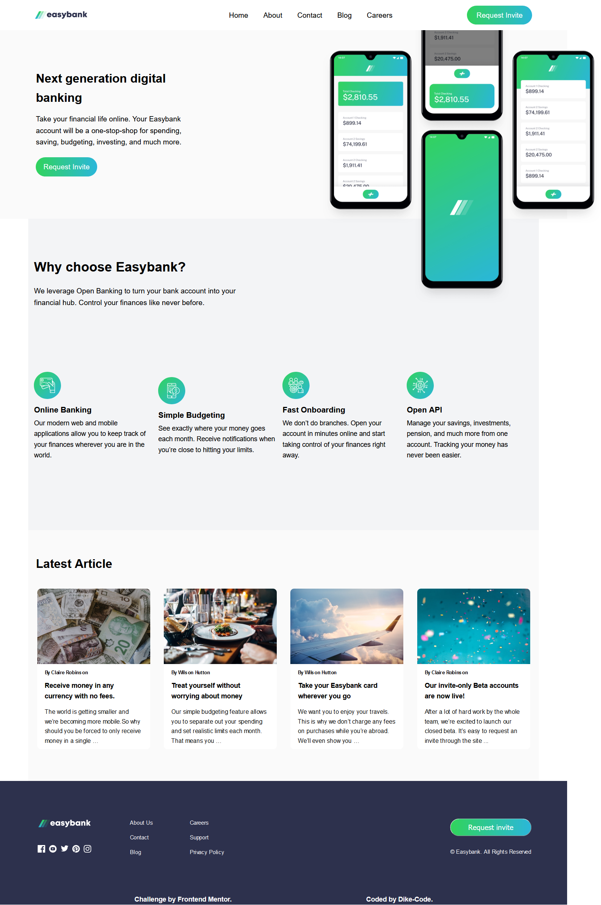
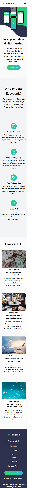

<!-- @format -->

# Frontend Mentor - Easybank landing page solution

This is a solution to the [Easybank landing page challenge on Frontend Mentor](https://www.frontendmentor.io/challenges/easybank-landing-page-WaUhkoDN). Frontend Mentor challenges help you improve your coding skills by building realistic projects.

## Table of contents

-  [Overview](#overview)
   -  [The challenge](#the-challenge)
   -  [Screenshot](#screenshot)
   -  [Links](#links)
-  [My process](#my-process)
   -  [Built with](#built-with)
   -  [What I learned](#what-i-learned)
   -  [Continued development](#continued-development)
   -  [Useful resources](#useful-resources)
-  [Author](#author)
-  [Acknowledgments](#acknowledgments)

## Overview

A Easy Bank Landing Page Solution from the Challange presented by Frontend Mentor... it's built with a pure HTML5 for laying out the structure, CSS for styling the website to make it more compelling, responsive and user friendly... A little bit of Javascript was also utilized in order to make the site more interactive.

### The challenge

Users should be able to:

-  View the optimal layout for the site depending on their device's screen size
-  See hover states for all interactive elements on the page

### Screenshot




### Links

-  Solution URL: [Add solution URL here](https://your-solution-url.com)
-  Live Site URL: [Add live site URL here](https://your-live-site-url.com)

## My process

### Built with

-  Semantic HTML5 markup
-  CSS custom properties
-  Flexbox
-  CSS Grid
-  Desktop-first workflow
-  Javascript

### What I learned

I learnt all whole lot.

```html
<section class="hero">
   <div class="hero__container">
      <div class="hero__img">
         
      </div>
   </div>
</section>
```

```css
.hero {
   position: relative;
   background-color: var(--Very-Light-Gray);
   background-position: 500px 50%;
   background-repeat: no-repeat;
   height: 500px;
   overflow: visible;
   z-index: -1;
}

.hero .hero__container {
   max-width: 90%;
   height: 100%;
   padding: 0 20px;
   margin: 0 auto;
   display: flex;
   align-items: center;
}
```

```js
const proudOfThisFunc = () => {
   console.log("🎉");
};
```

### Continued development

All, Practice... Practice and Practice.

### Useful resources

-  [Traversy Media](https://www.example.com) - This helped me with the full asimillation of CSS FLEX BOX and Grid. I really liked this pattern Brad uses in explaining all the concepts one needs to master this craft.

-  [Youtube](https://www.example.com) - This is an amazing website/platform which helped me finally understand a lot including the snippets on buiding a dropdown list. I'd recommend it to anyone still learning this concept.

## Author

-  Frontend Mentor - [@yourusername](https://www.frontendmentor.io/profile/yourusername)
-  Twitter - [@yourusername](https://www.twitter.com/yourusername)

## Acknowledgments

With utmost gratitude I'd like to acknowledge:
Freecodecamp
Traversy Media
Dev.Ed
Jon Dukket
Youtube.
